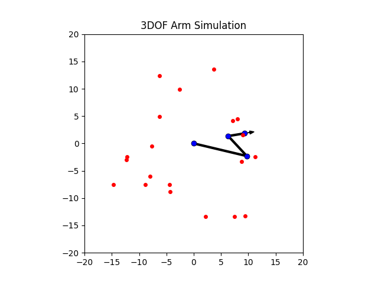
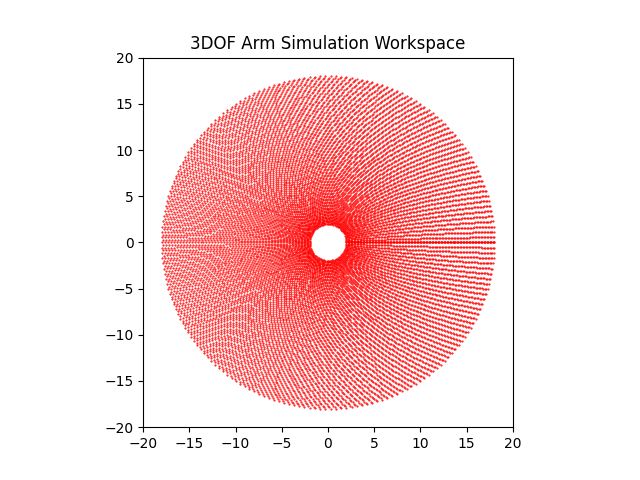

# 3DOF Robotic Arm Simulation

Planar three-degree-of-freedom(3DOF) manipulator simulation with workspace analysis and proportional kinematic control.

## Introduction

This project implements a planar 3DOF robotic arm using a direct geometric formulation. The simulation demonstrates
end-effector trajectory tracking and explores the manipulator’s behavior across its reachable workspace.
The mathematical derivations are documented separately in the project report.

## Mathematical Report

Full analytical development is available in:
📄 [Report_3DOF_2D_Robotic_Arm_Simulation.pdf](./Report_3DOF_2D_Robotic_Arm_Simulation.pdf)

The report covers:

- Geometric modeling and forward kinematics
- Analytical inverse kinematics
- Jacobian matrix
- Singularity analysis
- Workspace analysis
- Proportional control (kinematic)

## Path tracking Simulation Demo

The controller computes desired joint angles using analytical inverse kinematics and applies proportional control to
track the reference trajectory.

## Reachable Workspace Visualization

The workspace is generated by sweeping possible configurations. Its boundary reflects the geometric limits of the
manipulator.

## How to Run

1. Clone the repository
    - `git clone https://github.com/MarcoPais0/3DOF-2D-Robotic-Arm-Simulation.git`
2. Install dependencies
    - `pip install -r requirements.txt`
3. Run the simulation
    - `python src/3DOF_2D_Simulation_Path.py`
    - `python src/3DOF_2D_Simulation_Workspace.py`

## Requirements

- Python 3.10+
- NumPy
- Matplotlib

  All dependencies are listed in requirements.txt.